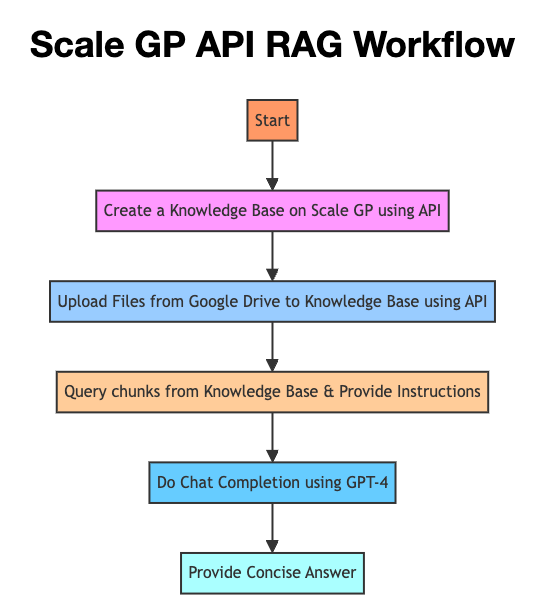

# Scale GP API Tech Assessment
This project is a demonstration of using the Scale GP APIs to create a web application that answers user-submitted questions based on context documents stored in different knowledge bases. The application leverages advanced Retrieval Augmented Generation (RAG) techniques to provide accurate and relevant answers.



## Features

- Query various knowledge bases (e.g., JPMorgan, Farmers, Chegg) for relevant documents.
- Utilize the Scale GP APIs to retrieve and process document content.
- Generate concise and accurate answers using GPT-4.
- Real-time streaming of chat completions for a dynamic user experience.
- User-friendly interface created with Streamlit.

## Installation

1. Clone the repository:
    ```sh
    git clone https://github.com/sun2ii/scale-trial.git
    cd scale-trial
    ```

2. Install the required packages:
    ```sh
    pip install -r requirements.txt
    ```

3. Create a `.env` file in the project root directory and add your Scale API key:
    ```
    API_KEY=your_api_key_here
    ```

## Usage

1. Run the Streamlit app:
    ```sh
    streamlit run streamlit.py
    ```

2. Open the provided URL in your web browser.

3. Enter your query in the text input box, select the desired knowledge base, and click "Submit". The app will query the selected knowledge base, retrieve relevant documents, and generate a response.

## Project Structure

- `streamlit.py`: Main Streamlit application file.
- `requirements.txt`: List of required Python packages.
- `upload-google.js`: Uploads a Google Folder onto the Scale GP Knowledge Base
- `.env`: File to store environment variables (e.g., API key).
