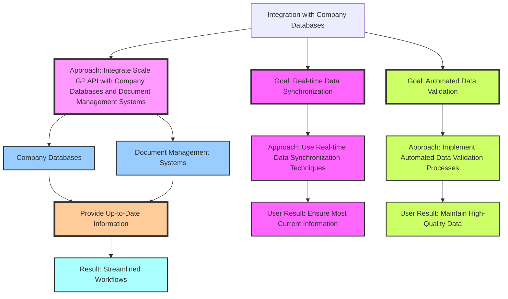

<h1>Integration with Company Database </h1>

```mermaid
graph TD
    A[Integration with Company Databases]

    A --> B[Approach: Integrate Scale GP API with Company Databases and Document Management Systems]
    B --> C[Company Databases]
    B --> D[Document Management Systems]
    C --> E[Provide Up-to-Date Information]
    D --> E
    E --> F[Result: Streamlined Workflows]

    A --> J[Goal: Real-time Data Synchronization]
    J --> K[Approach: Use Real-time Data Synchronization Techniques]
    K --> L[User Result: Ensure Most Current Information]

    A --> M[Goal: Automated Data Validation]
    M --> N[Approach: Implement Automated Data Validation Processes]
    N --> O[User Result: Maintain High-Quality Data]

    style B fill:#f9f,stroke:#333,stroke-width:4px
    style C fill:#9cf,stroke:#333,stroke-width:2px
    style D fill:#9cf,stroke:#333,stroke-width:2px
    style E fill:#fc9,stroke:#333,stroke-width:4px
    style F fill:#aff,stroke:#333,stroke-width:2px
    style J fill:#f6f,stroke:#333,stroke-width:4px
    style K fill:#f6f,stroke:#333,stroke-width:2px
    style L fill:#f6f,stroke:#333,stroke-width:2px
    style M fill:#cf6,stroke:#333,stroke-width:4px
    style N fill:#cf6,stroke:#333,stroke-width:2px
    style O fill:#cf6,stroke:#333,stroke-width:2px
```

