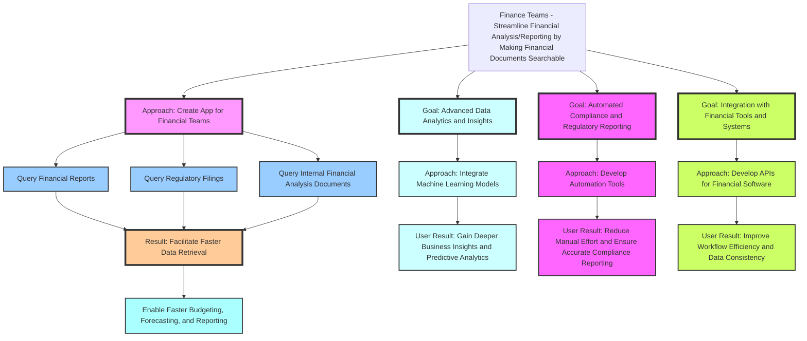

<h1>Basic Plan : JPMorgan Finance Teams</h1>

```mermaid
graph TD
    A[Finance Teams - Streamline Financial Analysis/Reporting by Making Financial Documents Searchable]

    A --> B[Approach: Create App for Financial Teams]
    B --> C[Query Financial Reports]
    B --> D[Query Regulatory Filings]
    B --> E[Query Internal Financial Analysis Documents]
    C --> F[Result: Facilitate Faster Data Retrieval]
    D --> F
    E --> F
    F --> G[Enable Faster Budgeting, Forecasting, and Reporting]

    A --> H[Goal: Advanced Data Analytics and Insights]
    H --> I[Approach: Integrate Machine Learning Models]
    I --> J[User Result: Gain Deeper Business Insights and Predictive Analytics]

    A --> K[Goal: Automated Compliance and Regulatory Reporting]
    K --> L[Approach: Develop Automation Tools]
    L --> M[User Result: Reduce Manual Effort and Ensure Accurate Compliance Reporting]

    A --> N[Goal: Integration with Financial Tools and Systems]
    N --> O[Approach: Develop APIs for Financial Software]
    O --> P[User Result: Improve Workflow Efficiency and Data Consistency]

    style B fill:#f9f,stroke:#333,stroke-width:4px
    style C fill:#9cf,stroke:#333,stroke-width:2px
    style D fill:#9cf,stroke:#333,stroke-width:2px
    style E fill:#9cf,stroke:#333,stroke-width:2px
    style F fill:#fc9,stroke:#333,stroke-width:4px
    style G fill:#aff,stroke:#333,stroke-width:2px
    style H fill:#cff,stroke:#333,stroke-width:4px
    style I fill:#cff,stroke:#333,stroke-width:2px
    style J fill:#cff,stroke:#333,stroke-width:2px
    style K fill:#f6f,stroke:#333,stroke-width:4px
    style L fill:#f6f,stroke:#333,stroke-width:2px
    style M fill:#f6f,stroke:#333,stroke-width:2px
    style N fill:#cf6,stroke:#333,stroke-width:4px
    style O fill:#cf6,stroke:#333,stroke-width:2px
    style P fill:#cf6,stroke:#333,stroke-width:2px
```

