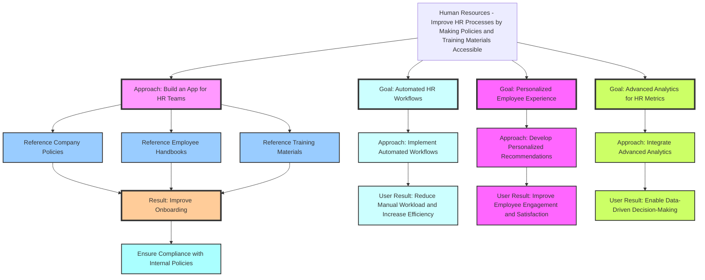

<h1>Basic Plan : JPMorgan HR Teams</h1>

```mermaid
graph TD
    A[Human Resources - Improve HR Processes by Making Policies and Training Materials Accessible]

    A --> B[Approach: Build an App for HR Teams]
    B --> C[Reference Company Policies]
    B --> D[Reference Employee Handbooks]
    B --> E[Reference Training Materials]
    C --> F[Result: Improve Onboarding]
    D --> F
    E --> F
    F --> G[Ensure Compliance with Internal Policies]

    A --> H[Goal: Automated HR Workflows]
    H --> I[Approach: Implement Automated Workflows]
    I --> J[User Result: Reduce Manual Workload and Increase Efficiency]

    A --> K[Goal: Personalized Employee Experience]
    K --> L[Approach: Develop Personalized Recommendations]
    L --> M[User Result: Improve Employee Engagement and Satisfaction]

    A --> N[Goal: Advanced Analytics for HR Metrics]
    N --> O[Approach: Integrate Advanced Analytics]
    O --> P[User Result: Enable Data-Driven Decision-Making]

    style B fill:#f9f,stroke:#333,stroke-width:4px
    style C fill:#9cf,stroke:#333,stroke-width:2px
    style D fill:#9cf,stroke:#333,stroke-width:2px
    style E fill:#9cf,stroke:#333,stroke-width:2px
    style F fill:#fc9,stroke:#333,stroke-width:4px
    style G fill:#aff,stroke:#333,stroke-width:2px
    style H fill:#cff,stroke:#333,stroke-width:4px
    style I fill:#cff,stroke:#333,stroke-width:2px
    style J fill:#cff,stroke:#333,stroke-width:2px
    style K fill:#f6f,stroke:#333,stroke-width:4px
    style L fill:#f6f,stroke:#333,stroke-width:2px
    style M fill:#f6f,stroke:#333,stroke-width:2px
    style N fill:#cf6,stroke:#333,stroke-width:4px
    style O fill:#cf6,stroke:#333,stroke-width:2px
    style P fill:#cf6,stroke:#333,stroke-width:2px
```

