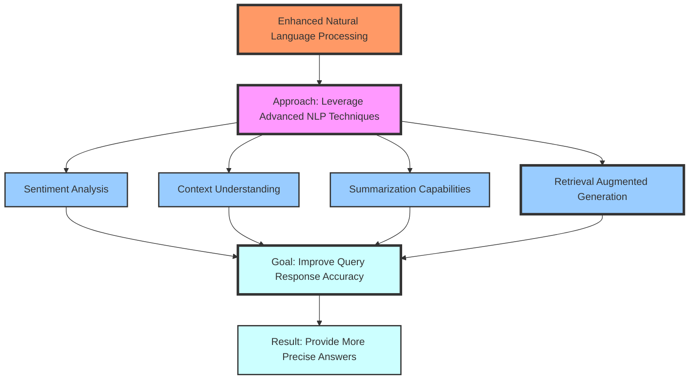

<h1>NLP Enhancements</h1>

```mermaid
graph TD
    A[Enhanced Natural Language Processing]

    A --> B[Approach: Leverage Advanced NLP Techniques]
    B --> C[Sentiment Analysis]
    B --> D[Context Understanding]
    B --> E[Summarization Capabilities]
    B --> F[Retrieval Augmented Generation]

    C --> S[Goal: Improve Query Response Accuracy]
    D --> S
    E --> S
    F --> S

    S --> T[Result: Provide More Precise Answers]

    style B fill:#f9f,stroke:#333,stroke-width:4px
    style C fill:#9cf,stroke:#333,stroke-width:2px
    style D fill:#9cf,stroke:#333,stroke-width:2px
    style E fill:#9cf,stroke:#333,stroke-width:2px
    style F fill:#9cf,stroke:#333,stroke-width:4px
    style S fill:#cff,stroke:#333,stroke-width:4px
    style T fill:#cff,stroke:#333,stroke-width:2px
    style A fill:#f96,stroke:#333,stroke-width:4px
```

