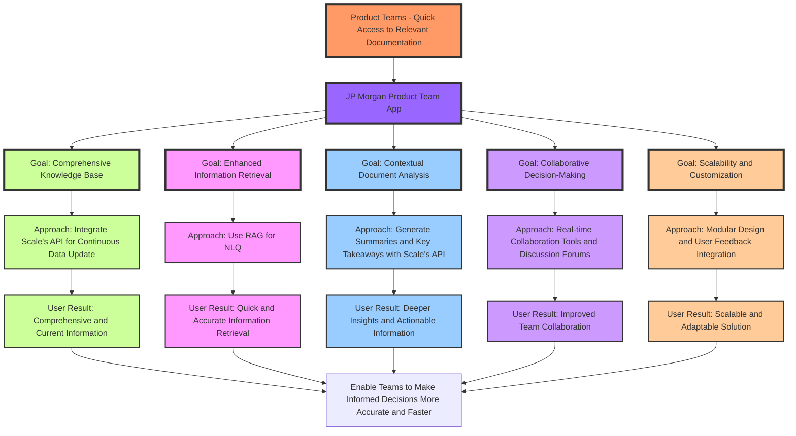

<h1>Basic Plan : JPMorgan Product Teams</h1>

```mermaid
graph TD
    A[Product Teams - Quick Access to Relevant Documentation] --> B["JP Morgan Product Team" App]

    B --> C[Goal: Comprehensive Knowledge Base]
    C --> D[Approach: Integrate Scale's API for Continuous Data Update]
    D --> E[User Result: Comprehensive and Current Information]

    B --> F[Goal: Enhanced Information Retrieval]
    F --> G[Approach: Use RAG for NLQ]
    G --> H[User Result: Quick and Accurate Information Retrieval]

    B --> I[Goal: Contextual Document Analysis]
    I --> J[Approach: Generate Summaries and Key Takeaways with Scale's API]
    J --> K[User Result: Deeper Insights and Actionable Information]

    B --> L[Goal: Collaborative Decision-Making]
    L --> M[Approach: Real-time Collaboration Tools and Discussion Forums]
    M --> N[User Result: Improved Team Collaboration]

    B --> O[Goal: Scalability and Customization]
    O --> P[Approach: Modular Design and User Feedback Integration]
    P --> Q[User Result: Scalable and Adaptable Solution]

    E --> R[Enable Teams to Make Informed Decisions More Accurate and Faster]
    H --> R
    K --> R
    N --> R
    Q --> R

    style F fill:#f9f,stroke:#333,stroke-width:4px
    style G fill:#f9f,stroke:#333,stroke-width:2px
    style H fill:#f9f,stroke:#333,stroke-width:2px

    style I fill:#9cf,stroke:#333,stroke-width:4px
    style J fill:#9cf,stroke:#333,stroke-width:2px
    style K fill:#9cf,stroke:#333,stroke-width:2px

    style L fill:#c9f,stroke:#333,stroke-width:4px
    style M fill:#c9f,stroke:#333,stroke-width:2px
    style N fill:#c9f,stroke:#333,stroke-width:2px

    style O fill:#fc9,stroke:#333,stroke-width:4px
    style P fill:#fc9,stroke:#333,stroke-width:2px
    style Q fill:#fc9,stroke:#333,stroke-width:2px

    style C fill:#cf9,stroke:#333,stroke-width:4px
    style D fill:#cf9,stroke:#333,stroke-width:2px
    style E fill:#cf9,stroke:#333,stroke-width:2px

    style A fill:#f96,stroke:#333,stroke-width:4px
    style B fill:#96f,stroke:#333,stroke-width:4px
```

