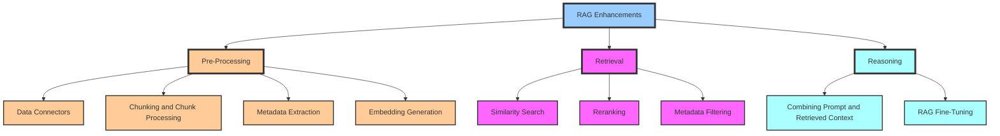

<h1>RAG Enhancements</h1>

```mermaid
graph TD
    A[RAG Enhancements]

    A --> B[Pre-Processing]
    B --> C[Data Connectors]
    B --> D[Chunking and Chunk Processing]
    B --> E[Metadata Extraction]
    B --> F[Embedding Generation]

    A --> G[Retrieval]
    G --> H[Similarity Search]
    G --> I[Reranking]
    G --> J[Metadata Filtering]

    A --> K[Reasoning]
    K --> L[Combining Prompt and Retrieved Context]
    K --> M[RAG Fine-Tuning]

    style A fill:#9cf,stroke:#333,stroke-width:4px
    style B fill:#fc9,stroke:#333,stroke-width:4px
    style C fill:#fc9,stroke:#333,stroke-width:2px
    style D fill:#fc9,stroke:#333,stroke-width:2px
    style E fill:#fc9,stroke:#333,stroke-width:2px
    style F fill:#fc9,stroke:#333,stroke-width:2px
    style G fill:#f6f,stroke:#333,stroke-width:4px
    style H fill:#f6f,stroke:#333,stroke-width:2px
    style I fill:#f6f,stroke:#333,stroke-width:2px
    style J fill:#f6f,stroke:#333,stroke-width:2px
    style K fill:#aff,stroke:#333,stroke-width:4px
    style L fill:#aff,stroke:#333,stroke-width:2px
    style M fill:#aff,stroke:#333,stroke-width:2px
```

