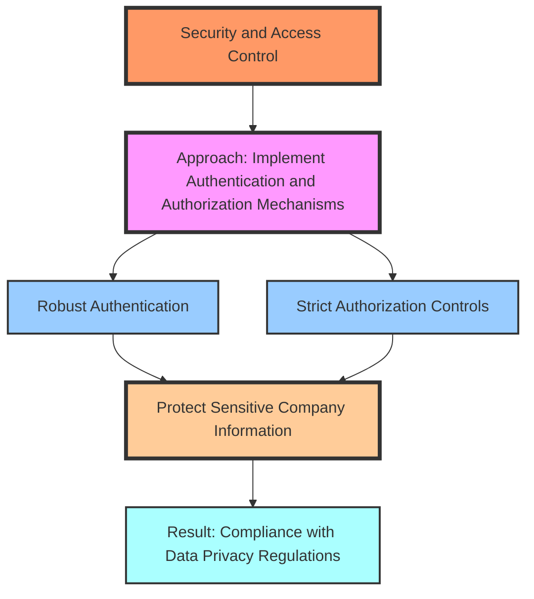

<h1>Security & Access Controls</h1>

```mermaid
graph TD
    A[Security and Access Control]

    A --> B[Approach: Implement Authentication and Authorization Mechanisms]
    B --> C[Robust Authentication]
    B --> D[Strict Authorization Controls]

    C --> E[Protect Sensitive Company Information]
    D --> E
    E --> F[Result: Compliance with Data Privacy Regulations]

    style B fill:#f9f,stroke:#333,stroke-width:4px
    style C fill:#9cf,stroke:#333,stroke-width:2px
    style D fill:#9cf,stroke:#333,stroke-width:2px
    style E fill:#fc9,stroke:#333,stroke-width:4px
    style F fill:#aff,stroke:#333,stroke-width:2px
    style A fill:#f96,stroke:#333,stroke-width:4px
```

