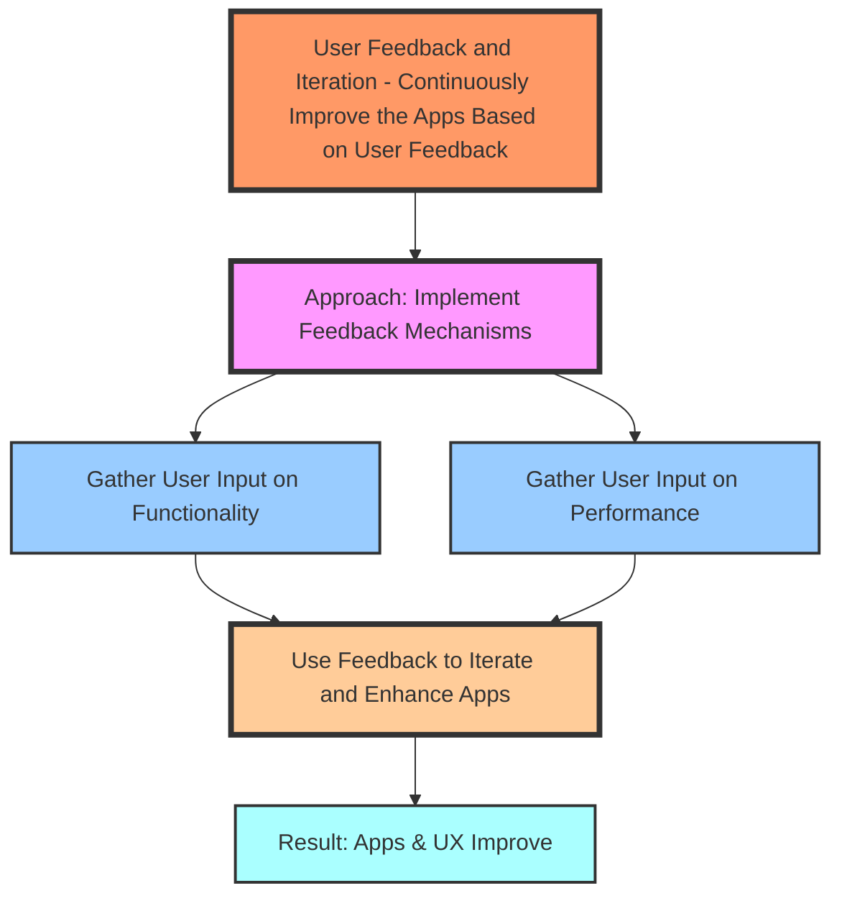

<h1>User Feedback</h1>

```mermaid
graph TD
    A[User Feedback and Iteration - Continuously Improve the Apps Based on User Feedback]

    A --> B[Approach: Implement Feedback Mechanisms]
    B --> C[Gather User Input on Functionality]
    B --> D[Gather User Input on Performance]

    C --> E[Use Feedback to Iterate and Enhance Apps]
    D --> E
    E --> F[Result: Apps & UX Improve]

    style B fill:#f9f,stroke:#333,stroke-width:4px
    style C fill:#9cf,stroke:#333,stroke-width:2px
    style D fill:#9cf,stroke:#333,stroke-width:2px
    style E fill:#fc9,stroke:#333,stroke-width:4px
    style F fill:#aff,stroke:#333,stroke-width:2px
    style A fill:#f96,stroke:#333,stroke-width:4px
```

